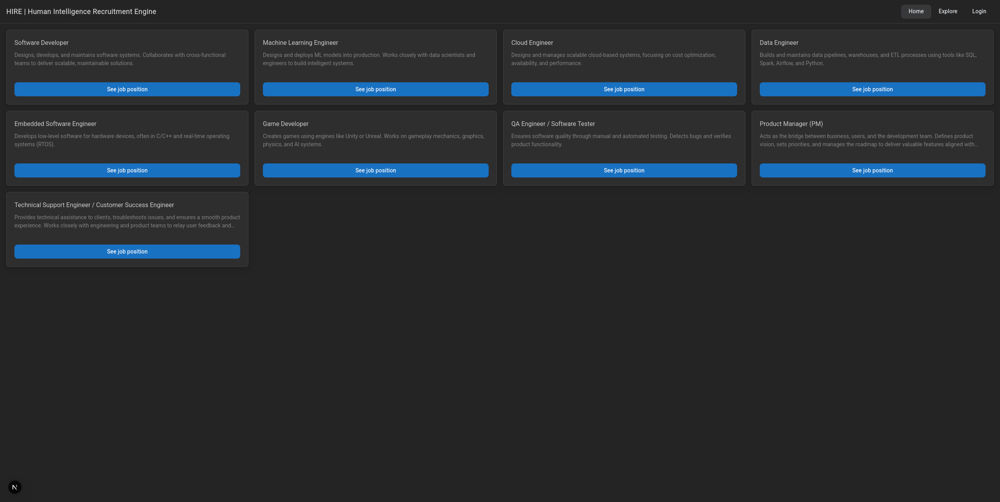
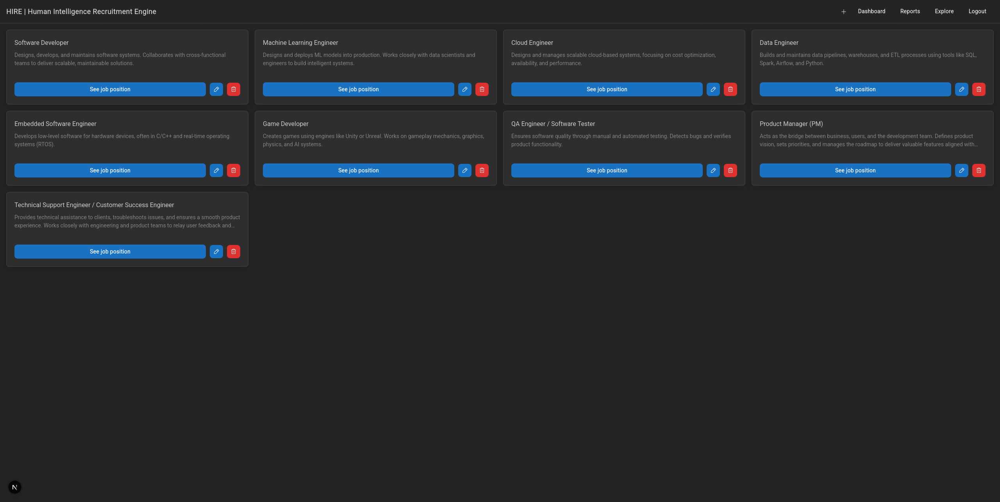
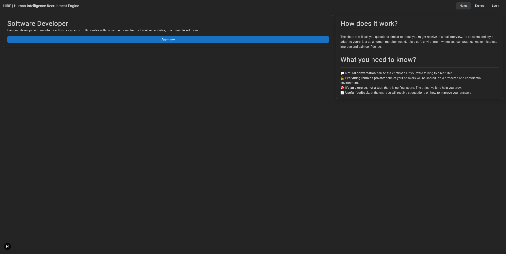
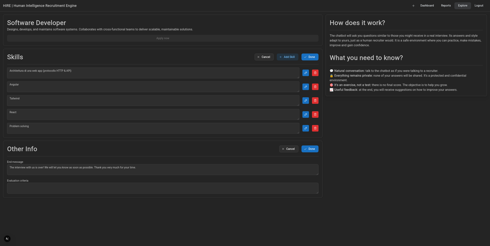
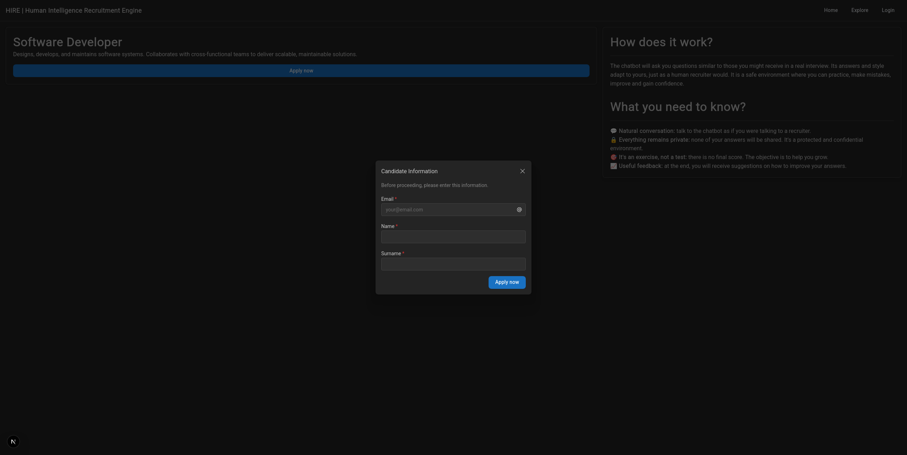
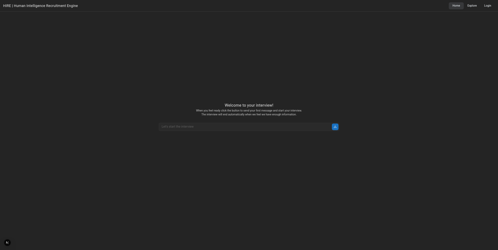
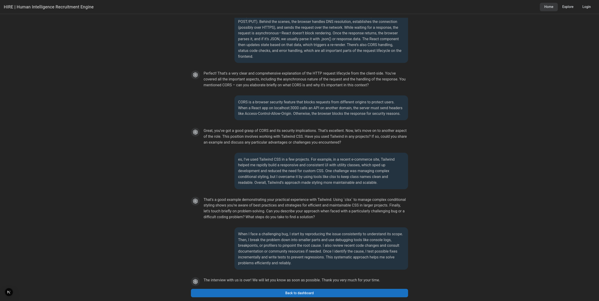
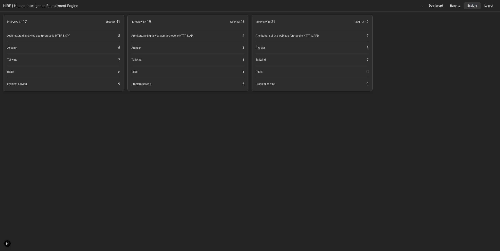

# What is HIRE?
**HIRE** (**H**uman **I**ntelligence **R**ecruitment **E**ngine) is a cutting-edge HR tech platform designed to **streamline** and **modernize** the **recruitment process** through **artificial intelligence**. It automates candidate screening and evaluation, providing scalable and objective hiring tools for companies.

# Core Features
- **AI interviewing**: text-based chatbot conducts dynamic interviews tailored to predefined skill set. The AI adapts its questions based on the depth and clarity of candidate responses, simulating a realistic and contextual conversation.
- **Automated screening**: candidates are automatically assessed and filtered based on skill alignment, reducing manual recruiter effort and time-to-hire.
- **HR dashboard**: a user-friendly interface enables recruiters to manage job postings, monitor candidate progress and access detailed interview analytics.
- **Job listing interface**: front-end module allows candidates to browse and apply to open roles.

# AI Capabilities
- Customizable question generation based on **HR-defined skill sets**.
- **Context-aware questioning** and follow-ups to dig deeper into candidate competencies.
- **Real-time skill evaluation** with both soft and hard skill focus.
- Engaging candidate experience via **adaptive conversational UI**.

# Links
- Presentation: https://gamma.app/docs/HIRE-Human-Intelligence-Recruitment-Engine-rt665kwi8a0v93k
- Back-end: https://github.com/matteo-convertino/hire-api
- Front-end: https://github.com/matteo-convertino/hire-web

# Screenshots
Below are some screenshots of the various pages of HIRE.

When talking about `MODERATORS`, it refers to users who can manage job positions.

When talking about `GUESTS`, it refers to users who are **not** logged into the system and who can apply for various job positions.

## Explore

## Dashboard (Moderator)

## Job position (Guest)

## Job position (Moderator)

## Application modal (Guest)

## Interview (Guest)

## Interview (Guest)

## Reports (Moderator)

